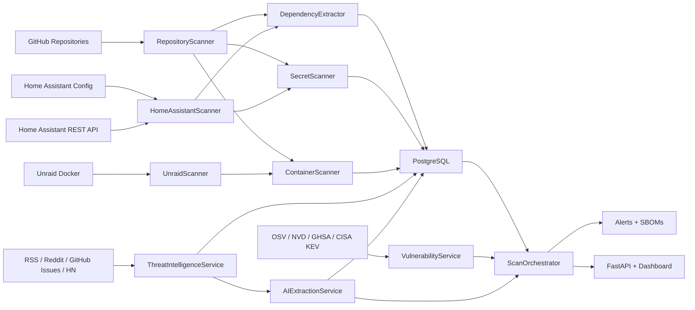

# Architecture

Purpose: Describe the modular design of `security-watchdog`, its data flow, and operational boundaries.  
Input/Output: This document maps source systems and scanners to storage, correlation, and alert outputs.  
Important invariants: PostgreSQL is authoritative, Redis is auxiliary, and every scanner writes audit-friendly `scan_results`.  
How to debug: Follow the numbered flow to find where data stopped appearing.

## High-Level Components

1. **Source inventory**
   - GitHub repository synchronization (`RepositoryScanner`)
   - Unraid Docker inventory (`UnraidScanner`)
   - Home Assistant integration inventory from local mounts or remote REST API (`HomeAssistantScanner`)
2. **Local collection**
   - Dependency extraction across supported manifest formats
   - Secret scanning with regex and entropy detection
   - Container scanning via Trivy and Grype
3. **External intelligence**
   - Vulnerability correlation against OSV, NVD, GitHub Advisories, and CISA KEV
   - Threat intelligence ingestion from RSS, Reddit, Hacker News RSS, and GitHub issues
   - AI extraction of structured package threats from unstructured articles
4. **Correlation and response**
   - Dependency-to-vulnerability matching
   - AI threat-to-dependency matching
   - Alert generation, SBOM generation, and multi-channel notifications
5. **Interfaces**
   - FastAPI REST endpoints
   - Browser dashboard
   - APScheduler worker for continuous operation

## Data Flow

## Module Responsibilities

- `app/scanners/*`: Collect and normalize raw evidence.
- `app/services/vulnerability_service.py`: Query structured advisory sources.
- `app/services/threat_intelligence.py`: Poll unstructured external feeds.
- `app/services/ai_extraction.py`: Extract structured package threats.
- `app/services/orchestrator.py`: Run end-to-end scan and correlation workflows.
- `app/services/alerts.py`: Send notifications.
- `app/services/sbom.py`: Write CycloneDX and SPDX documents.
- `app/api/routes.py`: Expose machine-readable endpoints.
- `app/dashboard/router.py` + templates/static files: Human-facing monitoring surface.

## Database Model

Core tables:

- `repositories`
- `dependencies`
- `vulnerabilities`
- `dependency_vulnerabilities`
- `scan_results`
- `threat_articles`
- `ai_extracted_threats`
- `alerts`

Design note:

- Unraid containers and Home Assistant integrations are represented as repository-like assets with `source_type` values such as `unraid_docker`, `homeassistant`, and `homeassistant_remote`. This keeps downstream correlation, reporting, and alerting consistent across all asset types.

## Scheduling

- Repository and asset scan: every 24 hours
- Threat feed collection: every 6 hours
- AI threat extraction: every 30 days

All schedules are configurable through environment variables.
